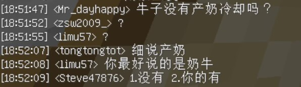

# StarLightHUB

[StartLight Server 交流群](https://jq.qq.com/?_wv=1027&k=rt0b2rlH)表情包仓库

本仓库灵感启发于[bangbang93hub](https://github.com/Mxmilu666/bangbang93HUB/tree/main?tab=readme-ov-file)

> [!WARNING]
>
> 本仓库内容可能含有 NSFW 的内容。另外本仓库仅供娱乐，禁止任何的非法用途，更没有任何攻击他人的想法
> 如有侵权，请提Issue删除

## What's this?

- 这里是一个 StartLight Server 群友自发创建的收集 StartLight 成员的圣经存放仓库，以便查看各位群友的~~黑历史~~

## 如何贡献此项目？

本项目欢迎提交pr！在pr之前，请按照以下规范提交：

- 图片命名请不要使用杂乱的名称，例如：**“QQ图片1145141919810”**

- 在提交发言/表情包时，**请不要提交因为违反SLS服规而被永久封禁的成员的发言**

- 在提交发言/表情包时，请注意内容分类

  我们接受以下几种分类方式：

  1. **昵称**分类

     假如群里的 **Steve47876** 发表了一个言论或一个表情包，如果你认为有纪念意义，那么请在仓库根目录下创建一个目录，如：`/Steve47876`。随后再将此言论/表情包添加到 `/Steve47876` 这个目录

     > 优先按照游戏ID来进行分类（请避免完全使用QQ群昵称来进行分类）

  2. **多人运动**分类

     如果图片中包含多位成员的发言 **（大于等于2人）**，那么请你将图片放到 `/多人运动` 这个目录下

  3. **其他**分类

     如果你认为此图片**不适用于另外几种分类方式**，那么请你将此图片放置在 `/其他分类` 目录下

- 提交的图片命名请根据图片内容来进行命名

  假如图片里的内容是：“**Steve47876：好想变成女孩子**”，那么图片的命名应该为：`好想变成女孩子.png`，并且放置在 `/Steve47876` 目录下
  
  如果图片内包含多位成员的发言或内容较多的发言，那么请你简要描述图片中的内容后再进行重命名
  
  > for example，
  >
  > 
  >
  > 根据以上图片的内容，该图片的命名可以为 `牛子产奶.png` 或者加一个书引号 `《牛子产奶》.png`
  > （能准确描述图片中的内容即可）

## 我可以做一些什么？

- 你可以随意的去群里发布这些表情包
- 你可以给 [SLS 服主打钱](https://afdian.com/a/StarLight666)，以确保我们~~不会被 群管理 Gank~~

> [!WARNING]
>
> 另外请你注意，在**其他无关的地方请不要乱刷这些表情包**。以免为他人带来困扰

## 甲级战犯名单

------

想加入 StarLight 大家庭吗？[点击这里](https://jq.qq.com/?_wv=1027&k=rt0b2rlH)来完成入服审核（什么？你不想通过审核入群？既然这样的话那请你[点击这个链接](https://www.bilibili.com/video/BV1GJ411x7h7)来直接进入群聊）
